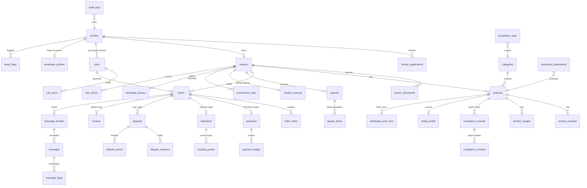

# Database Schema & ERD

Authoritative DDL lives in `supabase/migrations/0001_init.sql` (enums, tables,
constraints, RLS) and `0002_rls_policies.sql`. This document is the map.

## Entity-relationship diagram

## Table groups (44 tables)

### Identity & roles
- `profiles` — extends `auth.users`; `role: buyer|vendor|admin`, KYC state, risk tier.
- `vendor_applications` — multi-step JSON payload per step + status machine + reason codes + admin Q&A (`application_messages`).
- `vendors` — approved stores: slug, brand, seller_type, locations, policies, support info, wholesale/private-label flags, verification flags, reserve tier, commission override.
- `vendor_documents` — typed docs (EIN, license, insurance, ID, wallet-ownership proof), private storage path, review status.

### Catalog
- `categories` — tree, jurisdiction sensitivity class, age-restriction class, SEO fields.
- `products` — structured listing (all required fields from spec §product listing), `status: draft|pending_review|changes_requested|approved|live|suspended|delisted`, restricted_jurisdictions[], cannabinoid_type, wholesale flags.
- `product_variants` — sku, price_cents, stock, weight/dims, wholesale-only flag.
- `product_images`, `wholesale_price_tiers` (MOQ + tier pricing).

### Compliance
- `compliance_records` — one per batch/lot: coa file path + **sha256 hash**, lab name/site, issue/retest dates, structured results (Δ9-THC, total THC, THCA, CBD, CBG, other jsonb), pesticide/heavy-metal/microbial/solvent/foreign-material statuses, verification status/reviewer/date, expiry warning state, public badge eligibility.
- `compliance_reviews` — admin review actions (audit of verification decisions).

### Commerce
- `carts` (unique `(buyer_id, vendor_id)`), `cart_items`.
- `orders` — one vendor per order; state machine `pending_payment → paid → accepted → label_created → shipped → delivered → completed | cancelled | refunded | partially_refunded`; dispute-window timestamps; commission snapshot.
- `order_items` — price + compliance_record snapshot at purchase time.
- `payments` — BTCPay invoice id, method (onchain|lightning), amounts (invoice/received, under/overpay deltas), status, raw webhook payloads.
- `payment_ledger` — double-entry rows: buyer_payment, platform_commission, vendor_earnings, reserve_hold, reserve_release, refund, payout, adjustment.
- `commission_rules` — scoped platform default (12%) / category / vendor / product / wholesale, effective-dated.

### Fulfillment
- `shipments` — platform label: carrier, service, label cost, origin verified, status.
- `tracking_events` — validated carrier scans (acceptance scan required for `shipped`).

### Payouts & risk
- `payouts` — queue: eligible amount, wallet (verified), status `queued|approved|sent|failed|held`, admin notes, txid.
- `payout_items`, `vendor_reserves` (percent, rolling days, risk-tier schedule), `payout_holds`.
- `risk_scores` (vendor + buyer), `fraud_flags` (typed signals), `listing_health` (score + component inputs, internal-only).

### Trust & comms
- `reviews` — order-linked, product + vendor category ratings (accuracy, packaging, shipping, communication, overall), photos, verified flag, moderation status.
- `message_threads` (order- or product-linked), `messages` (immutable), `message_flags` (detector hits), `internal_notes`.
- `disputes`, `dispute_evidence`, `dispute_events` — full state machine from spec.

### Governance
- `jurisdiction_rules` — (country, region, category, cannabinoid_type) → allow/deny/notice + cross-border default-deny.
- `sponsored_placements`, `featured_placements` — with trust-gate eligibility checks.
- `audit_logs` — actor, action, entity, before/after jsonb, ip; insert-only.
- `wholesale_profiles`, `wholesale_access`, `wholesale_inquiries`, `referral_attributions`.
- `age_gate_policies` — per category-class × jurisdiction configuration.

## RLS posture (details in 0002)

- Public (anon): SELECT on `live` products, approved vendors, verified compliance summaries, published reviews. Nothing else.
- Buyers: own profile/carts/orders/messages/disputes/reviews (insert-only reviews on delivered orders — enforced via `security definer` check).
- Vendors: own store rows; products insert/update only while `status IN (draft, changes_requested)`; read own orders/payouts/reserves; **no** grants on reviews, tracking_events, payments, ledger.
- Admin: via `is_admin()` helper on JWT claim; still audited.
- Service role only: payments, ledger, tracking ingestion, payout execution, search sync.

## Migration plan

1. `0001_init.sql` — enums + tables + indexes + triggers (updated_at, audit).
2. `0002_rls_policies.sql` — enable RLS everywhere + policies + helper functions.
3. `seed.sql` — categories, jurisdiction defaults, demo vendors/products for staging.
4. Future migrations are additive; destructive changes require an ADR in docs/adr.
